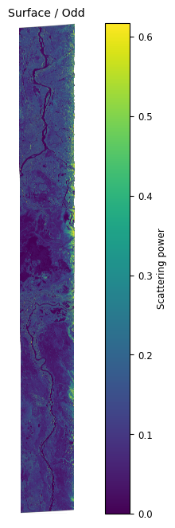
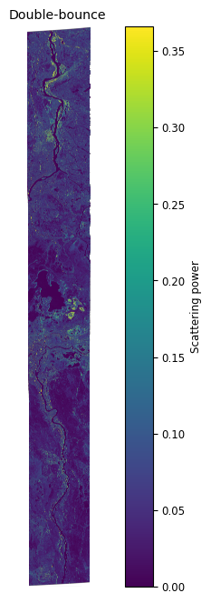
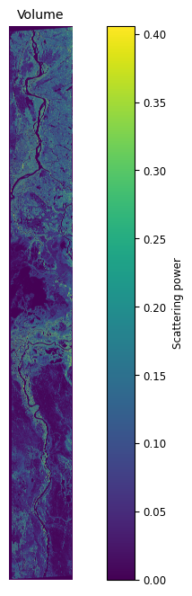
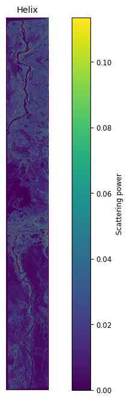
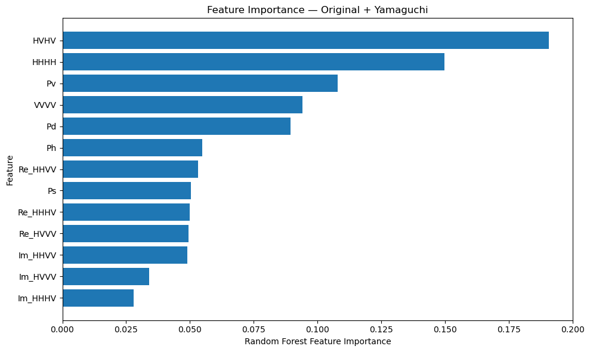
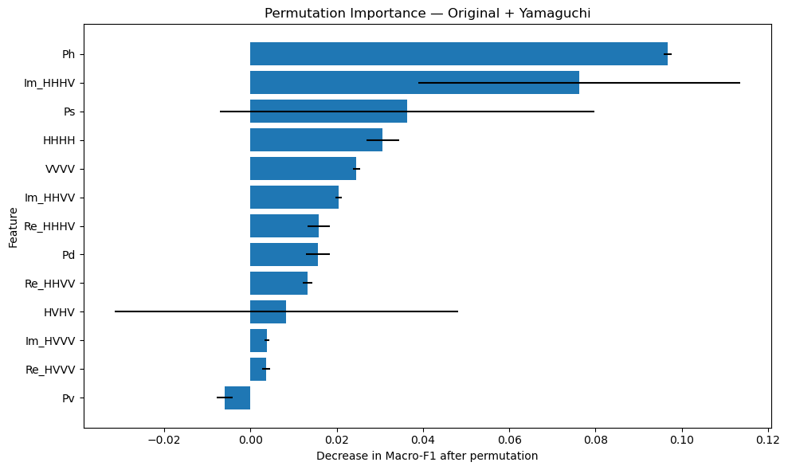

# Full-Polarimetric SAR Wetland Classification

**Study area:** Peace–Athabasca Delta (PAD), Canada  
**SAR data:** UAVSAR L-band full-polarimetric SAR  
**Classifier:** Random Forest  
**Classes:** Land, Open water, Wet graminoid, Wet shrubs, Wet forest

---

## Workflow

```text
UAVSAR Full-Pol
      ↓
C3 PolSAR features
      ↓
Yamaguchi 4-component decomposition
      ↓
Original / Yamaguchi / Combined features
      ↓
Random Forest
      ↓
5-class wetland classification
```

## PolSAR Representation

The UAVSAR multilooked products provide six independent components of the polarimetric covariance matrix.

The $3\times3$ covariance matrix is:

$$
\mathbf{C}_3 =
\begin{bmatrix}
HHHH & HHHV & HHVV\\
HHHV^* & HVHV & HVVV\\
HHVV^* & HVVV^* & VVVV
\end{bmatrix}
$$

where:

- $HHHH = \langle |S_{HH}|^2\rangle$
- $HVHV = \langle |S_{HV}|^2\rangle$
- $VVVV = \langle |S_{VV}|^2\rangle$
- $HHHV = \langle S_{HH}S_{HV}^{*}\rangle$
- $HHVV = \langle S_{HH}S_{VV}^{*}\rangle$
- $HVVV = \langle S_{HV}S_{VV}^{*}\rangle$

The complex off-diagonal components were represented using their real and imaginary parts for the machine-learning features.

---

## Yamaguchi 4-Component Decomposition

The covariance matrix is transformed into the Pauli coherency representation:

$$
\mathbf{T}_3 =
\mathbf{D}\mathbf{C}_3\mathbf{D}^{\dagger}
$$

where

$$
\mathbf{D} =
\frac{1}{\sqrt{2}}
\begin{bmatrix}
1&0&1\\
1&0&-1\\
0&\sqrt{2}&0
\end{bmatrix}
$$

The Yamaguchi decomposition separates the observed scattering into four components:

$$
P_{\mathrm{SPAN}} \approx P_s+P_d+P_v+P_h
$$

where:

- $P_s$ — Surface / odd-bounce scattering
- $P_d$ — Double-bounce scattering
- $P_v$ — Volume scattering
- $P_h$ — Helix scattering

The total polarimetric power is:

$$
P_{\mathrm{SPAN}} = C_{11}+C_{22}+C_{33}
$$

The decomposition was performed using the **PolSARtools Yamaguchi 4-component implementation**.
### Decomposition Results


| Surface / Odd-bounce | Double-bounce |
|---|---|
|  |  |

| Volume | Helix |
|---|---|
|  |  |

A power-conservation check was performed by comparing:

`HHHH + HVHV + VVVV`

with:

`Ps + Pd + Pv + Ph`

The decomposition showed good agreement for pixels with sufficient total power.

---

## Random Forest

The same polygon-level train/test split was used for all experiments:

- **81 training polygons**
- **20 test polygons**
- **67,693 training pixels**
- **23,016 test pixels**

---

## Classification Features

### A. Yamaguchi Features

The first experiment uses the four decomposition components:

$$
\mathbf{x}_{Y}=[P_s,P_d,P_v,P_h]
$$

**4 features**

### B. Original PolSAR Features

The original full-polarimetric feature vector contains the three diagonal power terms and the real and imaginary parts of the three complex correlations:

$$
\mathbf{x}_{P} =
[
HHHH,HVHV,VVVV,
\Re(HHHV),\Im(HHHV),
\Re(HHVV),\Im(HHVV),
\Re(HVVV),\Im(HVVV)
]
$$

**9 features**

### C. Combined Features

The combined experiment uses both original PolSAR and Yamaguchi features:

$$
\mathbf{x}_{C} =
[\mathbf{x}_{P},P_s,P_d,P_v,P_h]
$$

**13 features**

---

## Training and Testing

The labelled polygons were divided at the **polygon level**, ensuring that pixels from the same polygon were not split between training and testing.

- **81 training polygons**
- **20 test polygons**
- **67,693 training pixels**
- **23,016 test pixels**

The same split was used for all three experiments.

### Classes

| Class | Description |
|---|---|
| 1 | Land |
| 2 | Open water |
| 3 | Wet graminoid |
| 4 | Wet shrubs |
| 5 | Wet forest |

---

## Random Forest

For each pixel, the Random Forest predicts the wetland class from its feature vector:

$$
\hat{y}=f_{\mathrm{RF}}(\mathbf{x})
$$

The models were trained using:

- **300 trees**
- `random_state = 42`
- `n_jobs = -1`

---

## Results

| Experiment | Feature Set | Features | Overall Accuracy | Macro-F1 |
|---|---|---:|---:|---:|
| **A** | Yamaguchi | 4 | **80.66%** | **0.34** |
| **B** | Original PolSAR | 9 | **85.60%** | **0.37** |
| **C** | Original + Yamaguchi | 13 | **86.78%** | **0.38** |

### Main Findings

The **combined 13-feature model achieved the highest overall accuracy**.

- Original PolSAR → Combined: **+1.18 percentage points OA**
- Yamaguchi → Combined: **+6.12 percentage points OA**
- Yamaguchi → Original PolSAR: **+4.94 percentage points OA**

The original full-polarimetric features performed better than Yamaguchi features alone, while the Yamaguchi components provided additional complementary information when combined with the original features.

Wet vegetation remained challenging to separate, particularly **Wet graminoid and Wet shrubs**.

---

## Feature Importance

### Random Forest Impurity Importance

The approximate feature ranking of the combined model was:

```text
HVHV > HHHH > Pv > VVVV > Pd > Ph > ...
```



The decomposition features were used by the Random Forest, with **Pv, Pd and Ph** appearing among the higher-ranked features.

---

## Permutation Importance

Permutation importance was calculated using **macro-F1** as the evaluation metric.



The strongest permutation importance was observed for:

```text
Ph
Im_HHHV
Ps
HHHH
VVVV
...
```

Impurity importance and permutation importance measure different aspects of feature usefulness:

- **Impurity importance:** contribution to tree split decisions.
- **Permutation importance:** change in model performance after randomly shuffling a feature.

---

## Evaluation Metrics

Overall Accuracy was calculated as:

$$
OA =
\frac{\text{Number of correctly classified samples}}
{\text{Total number of samples}}
$$

For each class:

$$
F1 = \frac{2PR}{P+R}
$$

where $P$ is precision and $R$ is recall.

Macro-F1 is the mean F1 score across the five classes.

---

## Limitations

**Wet forest:** only one labelled polygon was available. It was therefore retained in the training set, meaning that independent test performance for Wet forest could not be evaluated.

The strong pixel-level class imbalance and spatial correlation within wetland polygons also mean that overall accuracy alone does not fully describe classification performance. Macro-F1 and class-level results are therefore reported alongside overall accuracy.

---

## Project Structure

```text
polsar-wetland-classification/
│
├── README.md
│
├── images/
│   ├── Yam4co_odd.png
│   ├── Yam4co_dbl.png
│   ├── Yam4co_vol.png
│   ├── Yam4co_hlx.png
│   ├── feature_importance.png
│   └── permutation_importance.png
│
└── ...
```

---

## Conclusion

This study shows that:

- Original full-polarimetric SAR features outperform Yamaguchi features alone.
- Yamaguchi decomposition provides complementary information for wetland classification.
- Combining the original PolSAR and Yamaguchi features produced the best result.
- The **13-feature combined model achieved 86.78% overall accuracy and 0.38 Macro-F1**.
- Separating wet vegetation classes remains the main classification challenge.

- **Limitation:** Wet forest had only one labelled polygon, which was kept in the training set. Therefore, independent test performance for Wet forest could not be evaluated.

The results demonstrate the potential of combining **physical polarimetric scattering descriptors** with **data-driven machine-learning features** for wetland classification.


